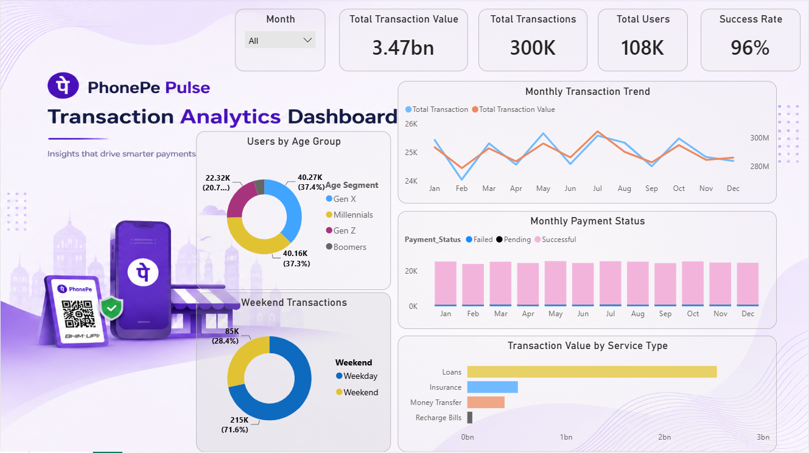
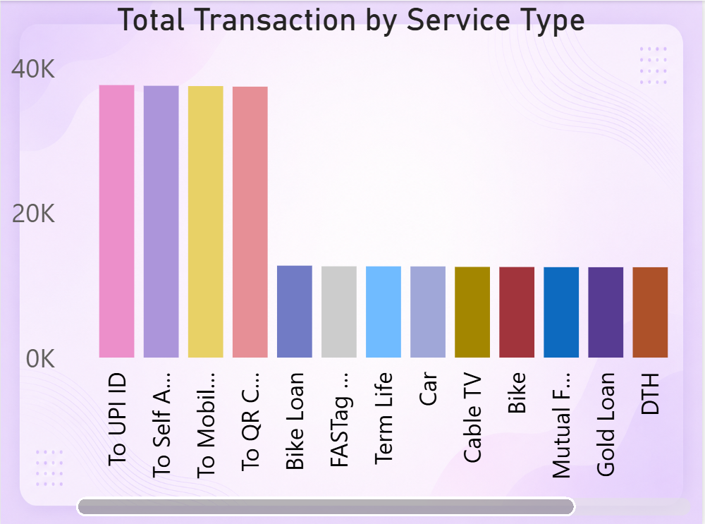

# 💜 PhonePe Pulse Transaction Analytics

<p align="center">
  
</p>

<p align="center">


</p>

---

# 📖 Project Overview

**PhonePe Pulse Transaction Analytics** is a modern Business Intelligence dashboard developed in **Microsoft Power BI** to analyze digital payment transactions and user behavior.

Inspired by the PhonePe design language, this dashboard combines interactive visualizations, executive KPI cards, custom DAX measures, time intelligence, user segmentation, payment status analysis, and custom tooltips into a single analytics solution.

The objective of this project is to transform raw transaction data into meaningful business insights that help understand transaction performance, customer behavior, and service usage.

---

# 🎯 Business Objective

Digital payment platforms generate millions of transactions every day.

Business teams need a centralized dashboard to answer questions such as:

- Which services generate the highest transaction value?
- How many transactions are successfully completed?
- Which user age groups perform the most transactions?
- How does transaction volume change month by month?
- What percentage of transactions happen during weekends?
- Which payment statuses require attention?

This dashboard answers these questions using interactive business intelligence techniques.

---

# ✨ Dashboard Features

### 📊 Executive KPI Cards

- Total Transaction Value
- Total Transactions
- Total Users
- Success Rate

---

### 📈 Trend Analysis

- Monthly Transaction Trend
- Monthly Payment Status Analysis

---

### 👥 User Analytics

- Users by Age Group
- Weekend vs Weekday Transactions

---

### 💳 Transaction Analytics

- Transaction Value by Service Type
- Interactive Month Filter
- Custom Power BI Tooltip

---

### 🎨 Dashboard Experience

- PhonePe Inspired UI
- Responsive Visual Layout
- Interactive Cross Filtering
- Modern Executive Design
- Custom Background Theme

---

# 🎯 Custom Tooltip Preview



---

# 📈 Executive KPIs

| KPI | Value |
|------|------:|
| Total Transaction Value | **3.47 Billion** |
| Total Transactions | **300K** |
| Total Users | **108K** |
| Success Rate | **96%** |

---

# 🧮 DAX Measures Created

The dashboard uses custom DAX measures for business calculations.

```DAX
Total Transaction Value

Total Transaction

Total Users

Success Rate

Successful Transaction

Total Transaction MoM%

Transaction Value MoM%

Total Transaction PM

Transaction Value PM
```

---

# 📅 Date Table

A dedicated Calendar Table was created using DAX to enable time intelligence calculations throughout the dashboard.

### Calendar Fields

- Date
- Year
- Quarter
- Month
- Month Number
- Day Number
- Weekday
- Weekend Flag

This Date Table powers all monthly trend analysis and time-based filtering.

---

# 💡 Business Insights

The dashboard provides several valuable insights, including:

- Transaction Success Rate reached **96%**, indicating strong payment reliability.
- Loan services contribute the highest transaction value among all available services.
- Weekday transactions account for the majority of platform activity.
- Gen X and Millennials are the largest transaction-performing user groups.
- Monthly transaction value remains stable with consistent growth patterns.
- Payment Status analysis helps identify Successful, Pending, and Failed transaction distribution.

---

# ⚙️ Interactive Features

✔ Executive KPI Cards

✔ Month Slicer

✔ Cross Visual Filtering

✔ Custom Tooltip Page

✔ Interactive Charts

✔ Responsive Dashboard Layout

✔ Business-Friendly Navigation

---

# 🛠️ Tools & Technologies

- Microsoft Power BI
- Microsoft Excel
- DAX
- Power Query
- Data Modeling
- Data Cleaning
- Business Intelligence
- Data Visualization

---

# 📂 Dataset

This project uses a structured PhonePe-style digital payment transaction dataset containing transaction records, payment status, service types, user demographics, and date-based information for analytical reporting.

### Data Preparation

- Removed unnecessary columns
- Cleaned inconsistent values
- Built a dedicated Date Table
- Created custom DAX measures
- Designed relationships between tables
- Optimized data model for reporting

---

# 📁 Project Structure

```text
PhonePe_Pulse_Transaction_Analytics_Dashboard/
│
├── Dataset/
│   └── Phonepe-Final-Dataset.xlsx
│
├── Background Image/
│   └── PhonePe_Background.png
│   └── Tooltip_Background.png
│
├── PowerBI/
│   └── PhonePe_Pulse_Transaction_Analytics_Dashboard.pbix
│
├── Screenshots/
│   ├── Main_Dashboard.png
│   ├── Tooltip.png
│
└── README.md
```

---

# 💼 Skills Demonstrated

This project demonstrates practical Business Intelligence and Data Analytics skills including:

- Data Cleaning
- Data Modeling
- DAX Calculations
- Time Intelligence
- KPI Development
- Dashboard Design
- Interactive Reporting
- Business Analytics
- Data Storytelling
- User Segmentation
- Executive Dashboard Development
- Custom Tooltip Design

---

# 🚀 Future Enhancements

Possible future improvements include:

- Year-over-Year (YoY) Analysis
- Quarter-over-Quarter (QoQ) Analysis
- Drill-through Reports
- Dynamic Theme Switching
- Mobile Dashboard Optimization
- Advanced User Behavior Analysis

---

# 🌟 Support

If you found this project helpful or inspiring:

⭐ Star this repository

🍴 Fork it

💡 Share your suggestions through GitHub Issues

Your feedback is always appreciated.

---

<p align="center">

### 💜 Designed & Developed using Microsoft Power BI

**Turning Digital Payment Data into Actionable Business Insights**

</p>
